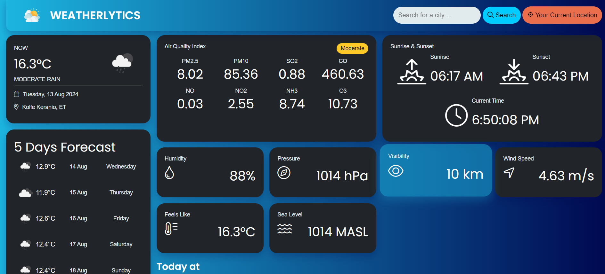
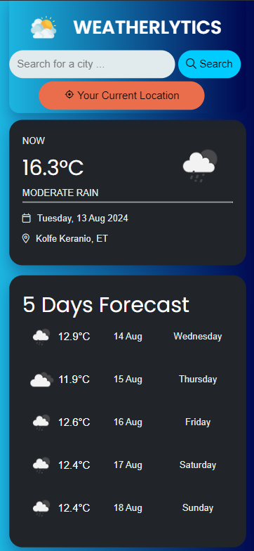

# WEATHERLYTICS

**Weatherlytics** is a web application that provides real-time weather updates, a 5-day forecast, and detailed weather highlights including air quality, humidity, wind speed, and more.
[Weatherlytics!](https://weathermapv2.netlify.app/)


## Features

- **Real-time Weather Data:** Get current temperature, weather conditions, and location-specific data.
- **5-Day Forecast:** View weather forecasts for the next five days, including temperature and weather descriptions.
- **Air Quality Index:** Monitor air quality with detailed breakdowns of PM2.5, PM10, SO2, CO, NO, NO2, NH3, and O3 levels.
- **Sunrise & Sunset:** View the daily sunrise and sunset times.
- **Additional Metrics:** Humidity, pressure, visibility, wind speed, feels-like temperature, and sea level.

## Screenshots

    Desktop


    Mobile


## Installation

1. Clone the repository:
    ```bash
    git clone https://github.com/yourusername/weatherlytics.git
    ```

2. Navigate to the project directory:
    ```bash
    cd weatherlytics
    ```

3. Open `index.html` in your browser to view the application.

## Usage

- **Search for a City:** Enter the name of a city in the search bar to view its weather data.
- **Current Location:** Click on "Your Current Location" to get weather updates for your current geographical location.

## Technologies Used

- **HTML5**
- **CSS3**
- **JavaScript**
- **Moment.js**
- **OpenWeatherMap API**

## Contributing

Contributions are welcome! Please fork the repository and create a pull request with your changes.


## Acknowledgments

- Icons provided by [FontAwesome](https://fontawesome.com/) and [BoxIcons](https://boxicons.com/).
- Weather data powered by [OpenWeatherMap](https://openweathermap.org/).

## Group Members - DRBSE2202-B
- Mintesnot Abebe
- Muhammed Siraj
- Naol Girma
- Yeabselam Kassaye
- Yonas Berhanu